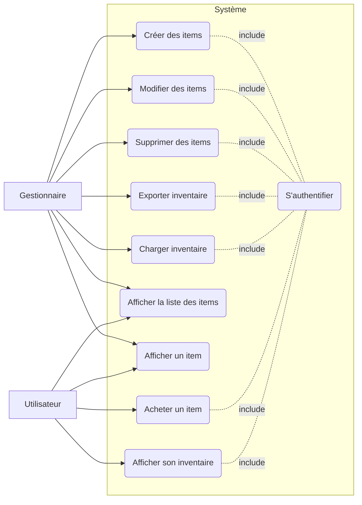
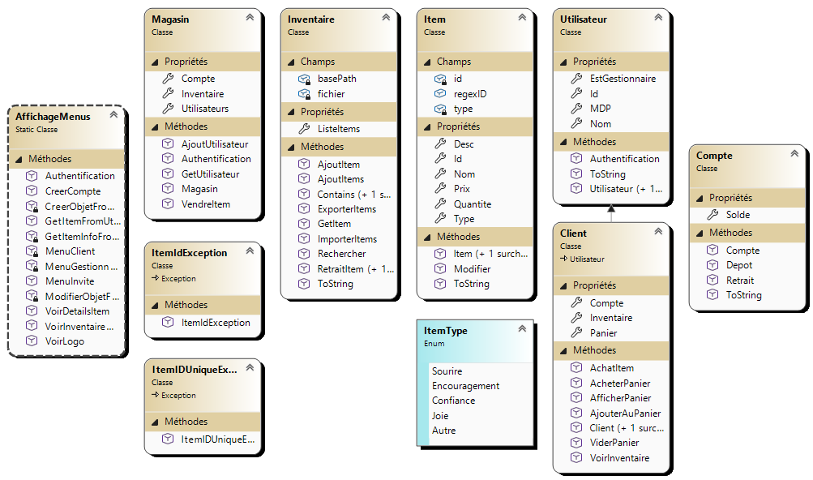

## Rappel : Diagramme de cas d'utilisation
L'essentiel d'un diagramme de cas d'utilisation sera présenté en classe. Si vous le souhaitez, voir les notes du cours de conception (5ème session) : https://projets420.gitbook.io/420-5a4-conception-de-logiciels/analyse/les-cas-dutilisation/diagramme-de-cas-dutilisation

Le diagramme de cas d'utilisation permet de représenter les interactions entre les différents utilisateurs d'un système et le système
* Il comprend :
  * **Acteur** : Une entité externe (utilisateur humain, autre système, capteur, etc.).
  * **Cas d'utilisation** : Une fonctionnalité du système utilisée par un acteur pour atteindre un objectif.
  * **Système** : Ce qui est modélisé (souvent représenté par un cadre), divisé en modules ou packages, au besoin.
  * **Les relations entre les cas d'utilisation**
    * **Association** (ligne simple) : Lien entre un acteur et un cas d'utilisation.
    * **Héritage** (flèche avec triangle vide) : Un acteur ou un cas d'utilisation peut hériter d'un autre.
    * **`<<include>>`** : Un cas d'utilisation inclut obligatoirement un autre (facteur commun).
    * **`<<extend>>`** : Un cas d'utilisation peut en appeler un autre dans certaines conditions.

# Exigences système
- Vous devez créer une application pour la gestion d'un magasin, sur le thème de votre choix, qui doit répondre au diagramme de cas d'utilisation fourni.
- Le magasin doit avoir des utilisateurs ayant différents rôles. Voir le diagramme de cas d'utilisation pour les identifier.
- Votre application doit inclure un système d'authentification pour authentifier les utilisateurs de l'application (ex. avec un id et un mot de passe).
- Chaque item doit avoir un code d'identification unique du style ABCXXXX (3 lettres suivies de 4 chiffres). Le système doit refuser la création d'un item si le code est déjà utilisé, et signaler une erreur si on tente d'accéder à un item inexistant.
- Chaque item doit avoir une description, un prix, une quantité en stock, et être catégorisé selon un type précis (à définir selon votre thème).
- L'inventaire du magasin doit pouvoir être exporté dans un fichier et rechargé au démarrage de l'application.
- Chaque client possède un compte avec un solde monétaire (montant de départ à définir). Un achat ne peut être complété que si le solde est suffisant.
- L'application doit être une application console avec un système de menus adaptés au rôle de l'utilisateur connecté.
- Optionnel (lorsque les fonctionnalités du diagramme de cas d'utilisation sont terminées) : Implémenter un panier d'achat : Ajouter un item au panier, afficher le panier, vider le panier et acheter les items du panier.

# Instructions et suggestions
1. Vous pouvez travailler seul ou en équipe, à votre choix.
2. En équipes de 2 de préférence : Commencez par faire une analyse rapide du diagramme de cas d'utilisation pour déterminer les classes, propriétés et méthodes claires pour démarrer (sans que ce soit parfait, ni très complet!).
3. Comparer votre analyse au diagramme fourni plus bas. Fiez vous aux classes principales et non pas au détail.
4. Pour l'importation et exportation de l'inventaire, vous pouvez attendre pour la gestion de fichiers au prochain cours ou suivre les notes de cours pour l'implémenter.
5. L'implémentation du panier d'achat décrit dans les exigences est optionnel, à faire si vous avez terminé le reste des exigences.

## Analyse et diagramme

- Classe Magasin : 
  - un inventaire 
  - une liste d'utilisateurs
  - authentification
  - importer/exporter une liste d'utilisateurs
- Classe inventaire : 
  - ajout à la liste d'items 
  - importer/exporter une liste d'items 
  - aller chercher un item dans la liste
  - suppression d'un item
- Classe Item : création, modification
- Classe Utilisateur : nom, id, mot de passe, role, inventaire, achat d'item

# Source
- Tiré et adapté d'un exercice de Valérie Levasseur.
